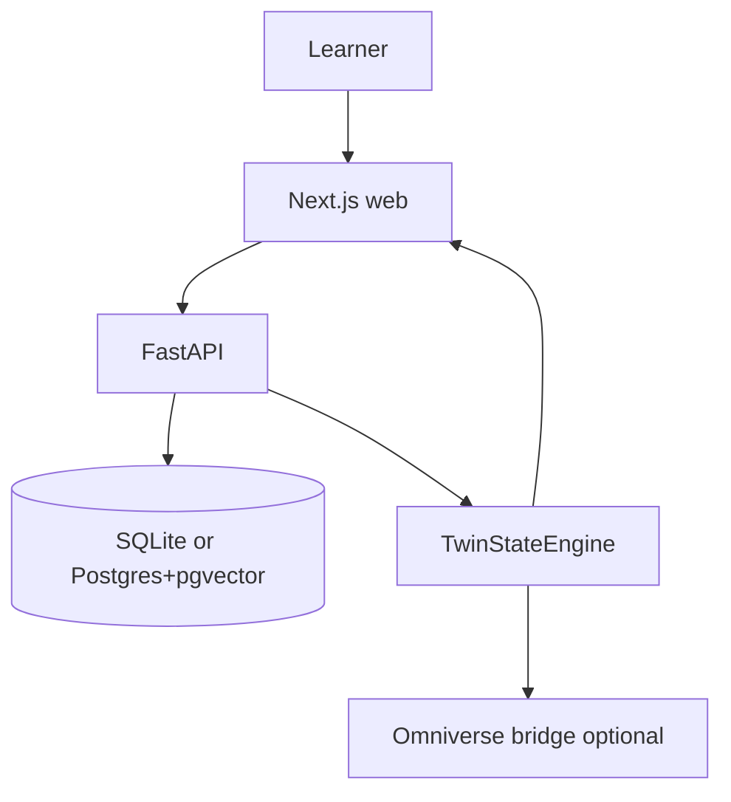

# LLM Twin Academy

Personalized technical learning for **NVIDIA Deep Learning Institute — Rapid Application Development Using Large Language Models**.

This is **not** a PDF chatbot and **not** the NVIDIA inference-at-scale (NIM Operator / KEDA / Dynamo / Grove) course. Those topics are out of scope unless Research Mode is explicitly enabled and labeled `EXTERNAL_RESEARCH`.

The loop:

**Learn → Predict → Experiment → Observe → Explain → Diagnose → Practice → Prove Mastery**

## Screenshots

Run locally and capture the dashboard, Notebook Studio, and a twin. Evidence badges must stay visible.

## Five-minute launch (no API key, no GPU)

```bash
python3 -m pip install -r services/api/requirements.txt
cd apps/web && npm install && cd ../..
chmod +x scripts/dev.sh
./scripts/dev.sh
```

Open http://localhost:3000

First screen asks **which APIs you want**. Choose **Demo** to stay offline. Then take the adaptive diagnostic — viewing content is not mastery.

`docker compose up` is the PostgreSQL + pgvector path when Docker is available.

## Modal

See `docs/LAUNCH.md`. Apps: `llm-twin-academy-api` and `llm-twin-academy-web`. Keep `MODAL_MIN_CONTAINERS=0` after the first live check.

## Architecture



## Course ingestion

Notebooks live in `course-materials/notebooks/`. PDF/PPTX are supported if you add them. Cells are **never executed**. This repo stores **no notebook outputs**; pipeline numbers in the UI are `EXPECTED_RESULT` or `SIMULATED_RESULT` unless you import an `ACTUAL_RUN`.

## AI tutor

Provider interface `TutorModelProvider`: Demo, OpenAI Responses API, NVIDIA NIM, HuggingFace. Course Mode refuses unsupported claims. Research Mode may call Perplexity and must label `EXTERNAL_RESEARCH`.

## Digital twins

Eleven web twins (pipeline, embeddings, attention, encoder heads, T5, multimodal, decoder sampling, quantization, LangChain memory, RAG/agent, assessment). Same JSON drives a future Omniverse scene. No Kit repo was present upstream.

## Voice

Optional ElevenLabs / Sarvam / OpenAI Realtime adapters. App starts with voice off.

## Experiment importer

JSON, CSV, AIPerf-like JSON, Prometheus text, kubectl/logs, OTEL JSON → `ACTUAL_RUN`. Comparison workbench flags confounders.

## Evidence model

See `docs/EVIDENCE_MODEL.md`. Simulations are never labeled actual.

## Testing

```bash
PYTHONPATH=services/api pytest tests/backend -q
```

Playwright specs live in `tests/e2e`.

## Deployment

- Web: Vercel (`apps/web`) with API rewrite
- API: Docker or Modal (`deploy/modal`)
- NVIDIA: `deploy/nvidia` (NIM / NVCF / Omniverse) — separate from web
